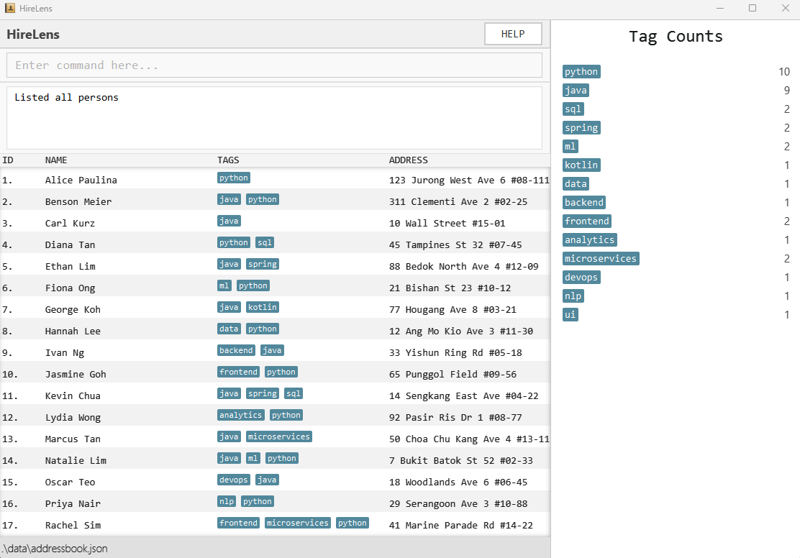

# HireLens User Guide

This project is based on the AddressBook-Level3 project created by the [SE-EDU initiative](https://se-education.org)

HireLens is a desktop application designed to help recruiters efficiently manage candidate information. It allows users to store candidate contact details, organise them with tags such as skills, and quickly filter candidates when shortlisting for job openings.

HireLens allows you to:
* Add, edit, and delete candidate contacts
* Tag candidates by skills or attributes
* Filter candidates by one or multiple tags
* View all stored candidates in a structured list
* Import multiple candidates using spreadsheet data
* ...and more!

For more information on HireLens, please see the below links:

[User Guide](https://ay2526s2-cs2103-f08-3.github.io/tp/UserGuide.html)

[Developer Guide](https://ay2526s2-cs2103-f08-3.github.io/tp/DeveloperGuide.html)
